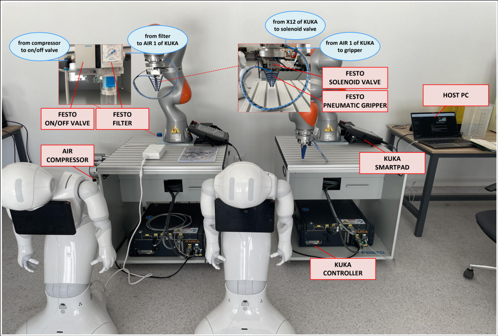
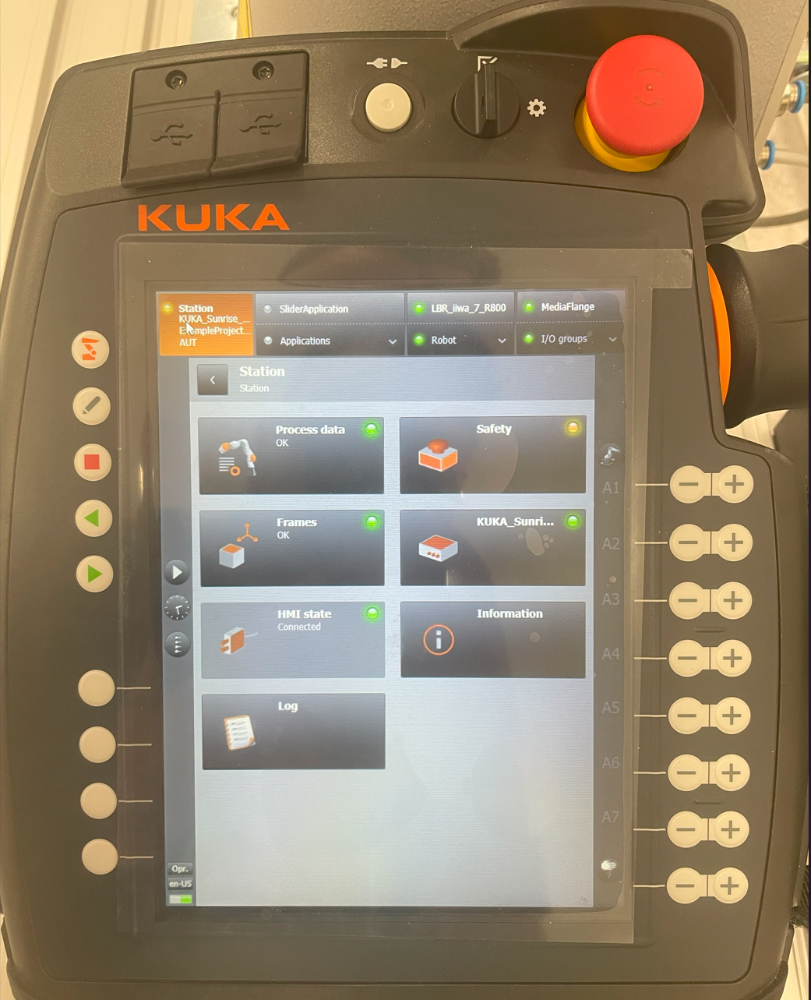
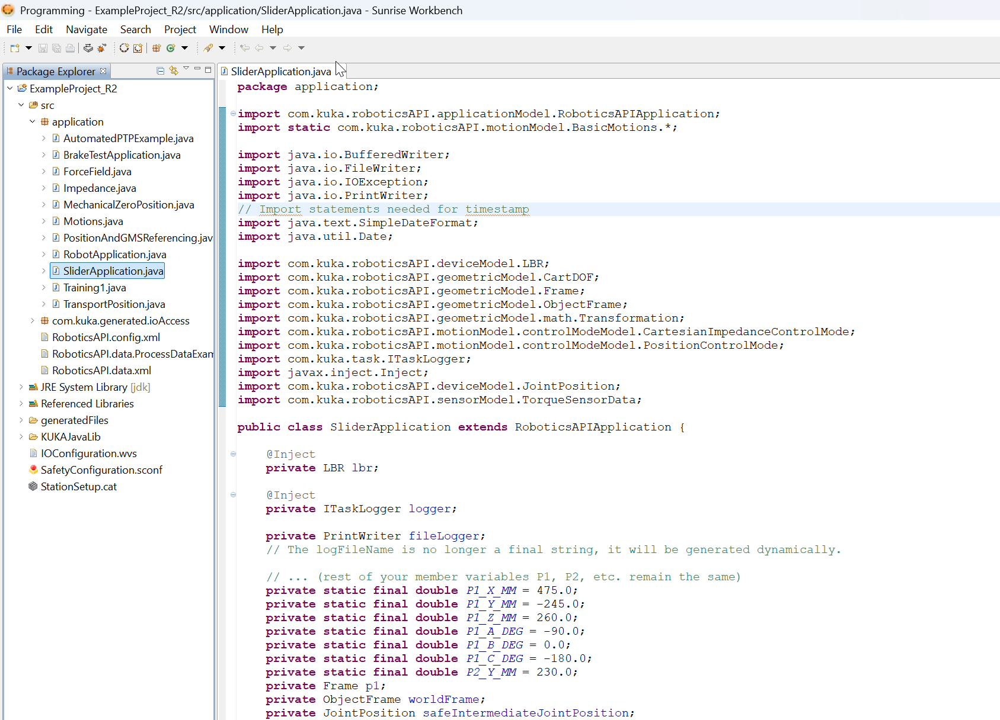

# KUKA Robotics Lab: Getting Started Guide
This guide provides the essential information one would need to get started with the KUKA LBR iiwa platform in the lab. Its purpose is to get them familiar with the hardware, software, and development workflow.

---

## 1. Hardware Overview

The setup consists of several key physical components.

### The KUKA LBR iiwa Robot Arm

The KUKA LBR iiwa 7 R800 is a 7-degree-of-freedom lightweight collaborative robot designed for sensitive manipulation tasks, featuring a 7 kg payload capacity and an 800 mm reach radius. This cobot integrates advanced joint torque sensors throughout its kinematic chain, enabling precise force and impedance control that makes it exceptionally well-suited for haptic interface applications. In research contexts, the LBR iiwa 7 R800 serves as a sophisticated haptic device capable of providing programmable force feedback to users while simultaneously capturing their input motions with high fidelity. Its inherent compliance and safety features allow for direct physical human-robot interaction without traditional safety barriers, making it ideal for studies involving teleoperation, skill transfer, rehabilitation robotics, and human-in-the-loop control systems where bidirectional force and motion information exchange between human operators and robotic systems is critical.

### The Sunrise Controller Cabinet

The KUKA Sunrise Cabinet serves as the "brain" of the LBR iiwa 7 R800, housing the primary controller that orchestrates all robot operations through a Windows-based operating system. This industrial PC platform provides the computational foundation for executing custom Java applications developed using KUKA's Sunrise.Workbench framework, allowing researchers to implement sophisticated control algorithms, sensor integration, and user interface components directly on the robot controller. The cabinet features essential connectivity options including Ethernet ports for network communication and data exchange with external systems, as well as USB ports for direct programming, data transfer, and peripheral device connections. This Windows-based architecture enables seamless integration with standard PC software tools and libraries while maintaining real-time control capabilities, making it particularly valuable for research applications where custom programming, data logging, and external system communication are fundamental requirements for experimental setups and algorithm development.

### The smartHMI (smartPAD)

The KUKA smartPAD serves as the primary human-machine interface for the LBR iiwa 7 R800, providing researchers with direct control capabilities through its intuitive touchscreen display and integrated safety features. This handheld teaching pendant allows operators to manually guide the robot, launch and monitor Java applications, access diagnostic information, and configure system parameters in real-time during experimental procedures. Critical safety elements include the three-position enabling switches located on the back of the device, which must be actively held in the middle position to permit robot motion, ensuring that any loss of operator control immediately halts all movement. Additionally, the prominent red emergency stop button on the front face provides instant system shutdown capability, cutting power to the robot drives and bringing all motion to an immediate stop when pressed. The smartPAD's combination of operational control and safety interlocks makes it indispensable for research environments where frequent manual intervention, application testing, and safety oversight are essential components of experimental protocols and system development workflows.

---

## 2. Software and Development Workflow

The development happens on a separate host PC and is then transferred to the robot controller.

### KUKA Sunrise.Workbench

Sunrise.Workbench is KUKA's Eclipse-based Integrated Development Environment (IDE) that serves as the primary software platform for developing, compiling, and managing Java applications for the LBR iiwa 7 R800 robot system. Built on the robust Eclipse framework, this specialized IDE provides researchers with comprehensive tools for writing custom robot control algorithms, implementing sensor interfaces, and creating sophisticated automation routines using KUKA's Sunrise.OS API libraries. The development environment offers standard IDE features including syntax highlighting, code completion, debugging capabilities, and project management tools, while also incorporating robot-specific functionalities such as application deployment, real-time monitoring, and direct communication with the robot controller. Researchers can leverage Sunrise.Workbench to compile their Java applications locally before transferring them to the robot's Windows-based controller for execution, enabling iterative development cycles where code can be tested, refined, and deployed efficiently. This integrated approach streamlines the development workflow for haptic interface applications and experimental control systems, allowing researchers to focus on algorithm implementation rather than low-level robot communication protocols.

